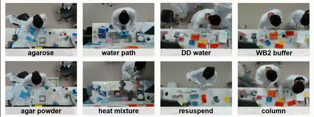
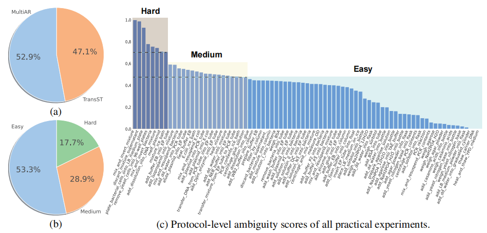
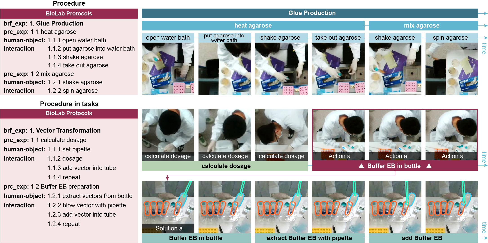
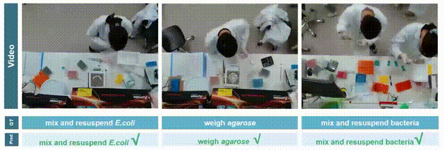
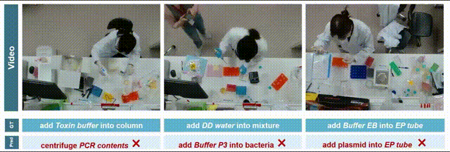
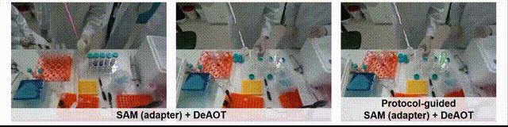

<center style="font-weight: bold">NeurIPS 2023 Track on Datasets and Benchmarks</center>
<!-- <header class="header-section "> -->
<div class="intro-header no-img">
  <div class="container-md">
    <div class="row">
      <div class="col-xl-8 offset-xl-2 col-lg-10 offset-lg-1">
        <div class="post-heading">
          <span class="post-heading">
            <a href="https://jiemingcui.github.io/">Jieming Cui</a><sup>1,2,*</sup>,
          </span>
          <span class="author-block">
            <a>Ziren Gong</a><sup>3,*</sup>,
          </span>
          <span class="author-block">
            <a href="https://buzz-beater.github.io/">Baoxiong Jia</a><sup>2,*</sup>,
          </span>
          <span class="author-block">
            <a href="https://siyuanhuang.com/">Siyuan Huang</a><sup>2</sup>,
          </span>
          <span class="author-block">
            <a href="https://zilongzheng.github.io/">Zilong Zheng</a><sup>2</sup>,
          </span>
          <span class="author-block">
            <a href="https://majianzhu.com/">Jianzhu Ma</a><sup>3,4</sup>,
          </span>
          <span class="author-block">
            <a href="https://yzhu.io/">Yixin Zhu</a><sup>1,2,5</sup>
          </span> 
          <br />
          <span class="post-meta"><sup>1</sup>Institute for Artificial Intelligence, Peking University,</span>
          <span class="post-meta"><sup>2</sup>National Key Laboratory of General Artificial Intelligence, BIGAI,</span>
          <span class="post-meta"><sup>3</sup>Institute for AI Industry Research, Tsinghua University</span>
          <span class="post-meta"><sup>4</sup>Department of Electronic Engineering, Tsinghua University</span>
          <span class="post-meta"><sup>5</sup>PKU-WUHAN Institute for Artificial Intelligence</span>
        </div>
      </div>
    </div>
  </div>
</div>

<!-- </header> -->

<!-- <div class="is-size-4 publication-authors">
    <p><span class="author-block"><strong>NeurIPS 2023 D&B</strong></span></p>
  <div class="is-size-5 publication-authors">
  </div>
  <div class="is-size-5 publication-authors">
    <span class="author-block"><sup>1</sup>Institute for Artificial Intelligence, Peking University,</span>
    <span class="author-block"><sup>2</sup>National Key Laboratory of General Artificial Intelligence, BIGAI,</span>
    <span class="author-block"><sup>3</sup>Institute for AI Industry Research, Tsinghua University</span>
    <span class="author-block"><sup>4</sup>Department of Electronic Engineering, Tsinghua University</span>
    <span class="author-block"><sup>5</sup>PKU-WUHAN Institute for Artificial Intelligence</span>
  </div>
</div> -->


<div style="display: flex; justify-content: center; align-items: center;">
  <span class="link-block" style="text-align: center; display: block; margin: 0 10px;">
    <a href="https://github.com/jiemingcui/probio/" target="_blank" class="external-link button is-normal is-rounded is-dark">
      <span class="icon">
        <i class="fab fa-github"></i>
      </span>
      <span>Code</span>
    </a>
  </span>
  <span class="link-block" style="text-align: center; display: block; margin: 0 10px;">
    <a href="https://arxiv.org/abs/2311.00556" target="_blank" class="external-link button is-normal is-rounded is-dark">
      <span class="icon">
        <i class="far fa-file-alt"></i>
      </span>
      <span>Paper</span>
    </a>
  </span>
  <span class="link-block" style="text-align: center; display: block; margin: 0 10px;">
    <a href="https://drive.google.com/file/d/1IBHlKTDnBTdENKykp0s_ps6HvSuFvDLX/view" target="_blank" class="external-link button is-normal is-rounded is-dark">
      <span class="icon">
        <i class="far fa-database"></i>
      </span>
      <span>Dataset</span>
    </a>
  </span>
</div>


<!-- <p align="center">
    <a href='https://github.com/jiemingcui/probio/', target="_blank">[Code]
    </a>
    <a href='https://arxiv.org/abs/<ARXIV PAPER ID>', target="_blank">[ArXiv]
    </a>
</p> -->
<!-- Github link -->

<br>


The challenge of replicating research results has posed a significant impediment to the field of molecular biology. The advent of modern intelligent systems has led to notable progress in various domains. Consequently, we embarked on an investigation of intelligent monitoring systems as a means of tackling the issue of the reproducibility crisis. Specifically, we first curate a comprehensive multimodal dataset, named **ProBio**, as an initial step towards this objective. This dataset comprises fine-grained hierarchical annotations intended for the purpose of studying activity understanding in Molecular Biology Lab (BioLab). Next, we devise two challenging benchmarks, transparent solution tracking and multimodal action recognition, to emphasize the unique characteristics and difficulties associated with activity understanding in BioLab settings. Finally, we provide a thorough experimental evaluation of contemporary video understanding models and highlight their limitations in this specialized domain to identify potential avenues for future research. We hope **ProBio** with associated benchmarks may garner increased focus on modern AI techniques in the realm of molecular biology.


<hr>

## Video

<div class="extensions extensions--video">
<!-- <iframe width="920" height="580" src="https://vimeo.com/898064557" title="YouTube video player" allow="accelerometer; autoplay; clipboard-write; encrypted-media; gyroscope; picture-in-picture; web-share" frameborder="0" scrolling="no" allowfullscreen></iframe>
</div> -->

<iframe src="https://player.vimeo.com/video/898064557?h=7e7fd00948&color=94070A&byline=0&portrait=0" width="920" height="580" frameborder="0" allow="autoplay; fullscreen; picture-in-picture" allowfullscreen></iframe>
<!-- <p><a href="https://vimeo.com/898064557">[NeurIPS 2023] ProBio: A Protocol-guided Multimodal Dataset for Molecular Biology Lab</a> from <a href="https://vimeo.com/yzhu">Yixin Zhu</a> on <a href="https://vimeo.com">Vimeo</a>.</p> -->
</div>

<hr>

## ProBio Dataset
<!-- ### Visualization of the ambiguous actions in BioLab. -->

<div class="card bg-light border-light mb-3">
    
    <div class="card-body">
      <h5 class="card-title">Figure 1. Visualization of the ambiguous actions in BioLab.</h5>
    </div>
</div>

<div class="card bg-light border-light mb-3">
    
    <div class="card-body">
      <h5 class="card-title">Figure 2. Part-to-whole & Ambigutiy distribution.</h5>
    </div>
</div>

<hr>

## Benchmark
### Task description
<div class="card bg-light border-light mb-3">
    
</div>

We show activities recorded (right) and their corresponding protocols (left). HOI annotations are visualized in the top row. The bottom row gives an example of how knowledge in protocols guides (i) the recognition of actions (in red) given matched actions (green) and (ii) tracking the transparent solution status (blue).

### Result visualization
#### Multimodal action recognition (MultiAR)

<div class="card bg-light border-light mb-3">
    
</div>
<div class="card bg-light border-light mb-3">
    
</div>

#### Transparent solution tracking (TransST)
<div class="card bg-light border-light mb-3">
    
</div>


<hr>

## Download

Our dataset is distributed under the [CC BY-NC-SA (Attribution-NonCommercial-ShareAlike)](https://creativecommons.org/licenses/by-nc-sa/4.0/) license. You can download our dataset from [Link here](https://docs.google.com/forms/d/e/1FAIpQLSe6NpXCq3rsgArf91o81jMLhA0MWjKDibVKFWwiBXPddoMSNw/viewform?usp=sf_link).

<hr>

## Citation

```bibtex
@inproceedings{cui2023probio,
    title={ProBio: A Protocol-guided Multimodal Dataset for Molecular Biology Lab},
    author={Jieming Cui, Ziren Gong, Baoxiong Jia, Siyuan Huang, Zilong Zheng, Jianzhu Ma, Yixin Zhu},
    booktitle={NeurIPS},
    year={2023}
}
```
