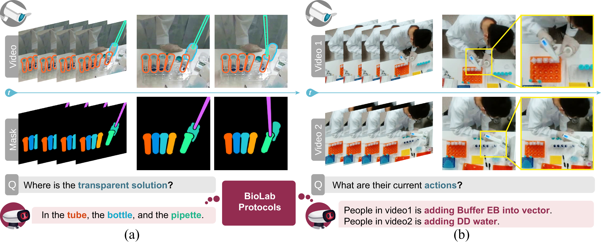

The challenge of replicating research results has posed a significant impediment to the field of molecular biology. The advent of modern intelligent systems has led to notable progress in various domains. Consequently, we embarked on an investigation of intelligent monitoring systems as a means of tackling the issue of the reproducibility crisis. Specifically, we first curate a comprehensive multimodal dataset, named **ProBio**, as an initial step towards this objective. This dataset comprises fine-grained hierarchical annotations intended for the purpose of studying activity understanding in Molecular Biology Lab (BioLab). Next, we devise two challenging benchmarks, transparent solution tracking and multimodal action recognition, to emphasize the unique characteristics and difficulties associated with activity understanding in BioLab settings. Finally, we provide a thorough experimental evaluation of contemporary video understanding models and highlight their limitations in this specialized domain to identify potential avenues for future research. We hope **ProBio** with associated benchmarks may garner increased focus on modern AI techniques in the realm of molecular biology.

## Dataset


## Paper


## Download

Our dataset is distributed under the [CC BY-NC-SA (Attribution-NonCommercial-ShareAlike)](https://creativecommons.org/licenses/by-nc-sa/4.0/) license. You can download our dataset from [Link here](link_here).


## Citation

```bibtex
@inproceedings{cui2023probio,
    title={ProBio: A Protocol-guided Multimodal Dataset for Molecular Biology Lab},
    author={Jieming Cui, Ziren Gong, Baoxiong Jia, Siyuan Huang, Zilong Zheng, Jianzhu Ma, Yixin Zhu},
    booktitle={NeurIPS 2023 Datasets and Benchmarks Track (Under Review)},
    year={2023}
}
```